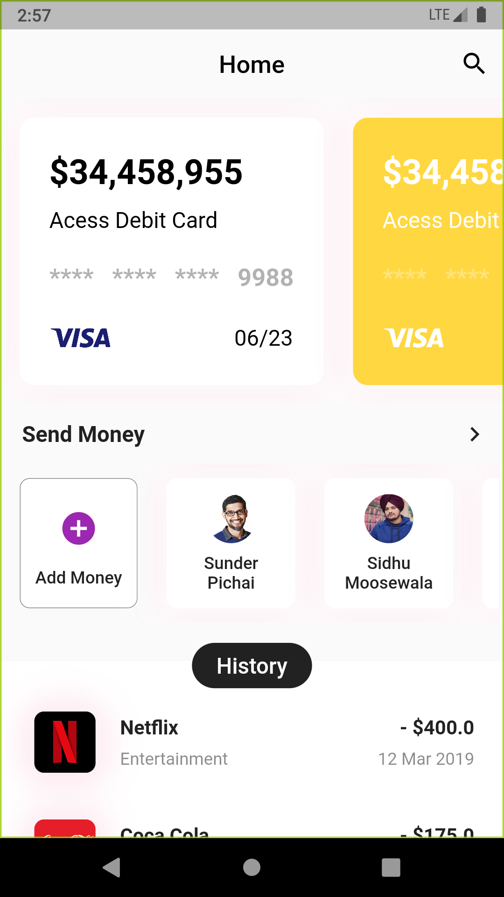
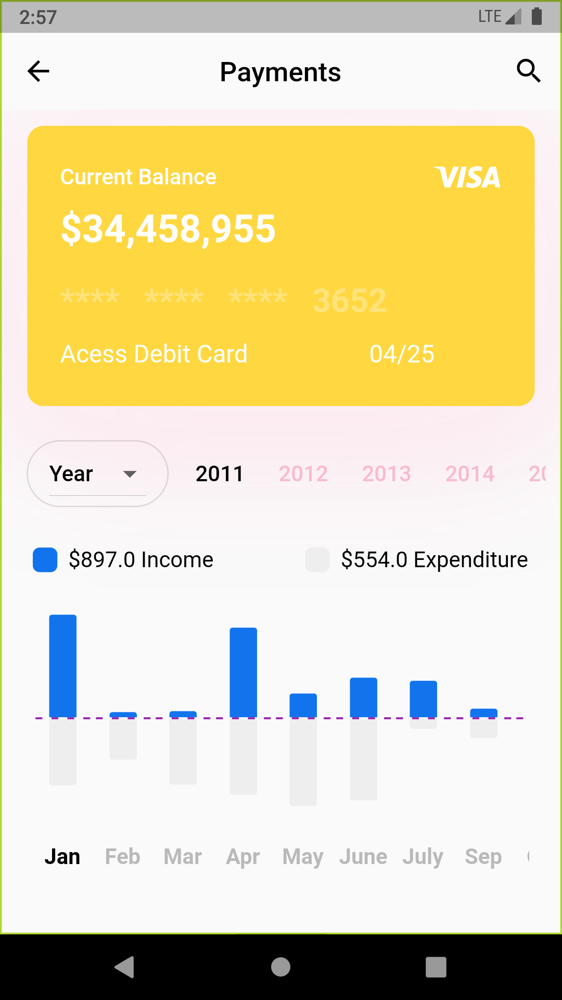

<h1 align="center">piggie-bank 👋</h1>
<p>
  
</p>

A minimalistic money manager application

### 🏠 [Homepage](https://github.com/alphaolomi/piggie-bank/)

##  Screenshots

| Home                     | Card                     |
| ------------------------ | ------------------------ |
|  |  |

## Development 

### Install

```sh
flutter pub get
```

### Run

```sh
flutter run
```

### Run tests

```sh
flutter test
```

## Author

- 👤 **Alpha Olomi**
  - Website: https://alphaolomi.me
  Github: [@alphaolomi](https://github.com/alphaolomi)

- 👤 **James Cdo**
  - Website: https://james.me
 Github: [@jemcdo](https://github.com/jamescdo)

## Misc